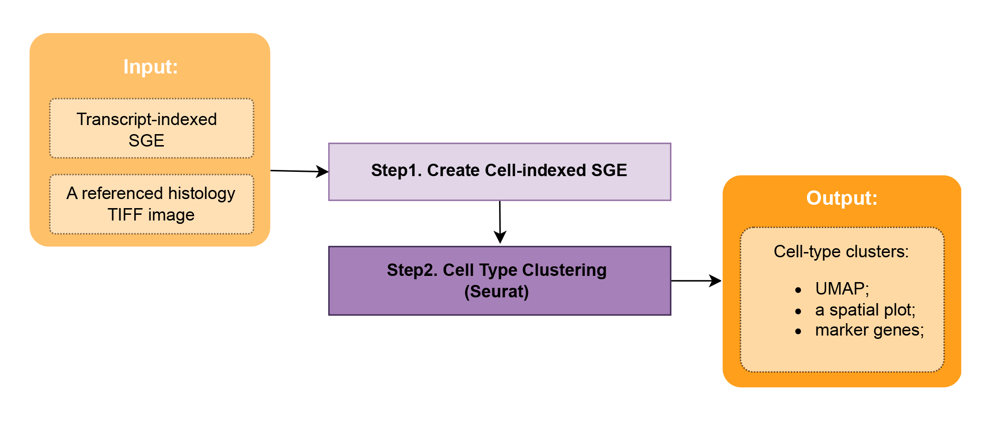

# Preliminary Single-Cell Analysis

This is an example to illustrate aggregating the spatial transcriptomic data from [NovaScope](https://github.com/seqscope/NovaScope/tree/main) at the cell level, and clustering cells using [Seurat](https://satijalab.org/seurat/) build-in graph-based clustering approach. 

**Figure 2: A Brief Overview of the Inputs, Outputs, and Process Steps for Preliminary Single-Cell Analysis.** SGE: spatial digital gene expression matrix; UMAP: Uniform Manifold Approximation and Projection.

## Step-by-Step Procedure

Before beginning the analysis, ensure that NEDA and its dependencies are [installed](../../installation/installation.md) in your computing environment. Follow these steps as outlined:

1. Create a cell-indexed spatial digital gene expression matrix.

2. Apply Seurat to identify cell type clusters for those staining-based segmented cells.
