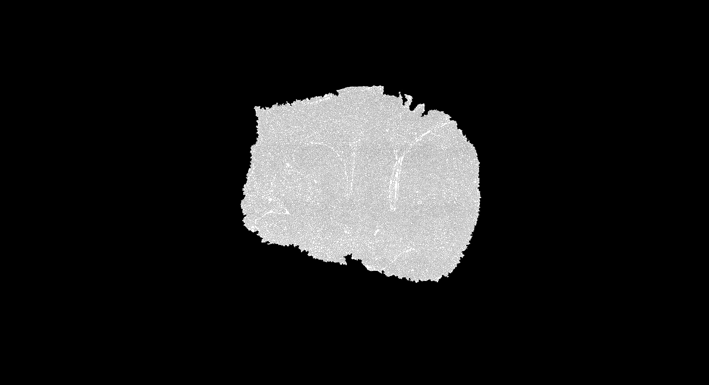

# Step1. Prepare Cell-indexed Spatial Digital Gene Expression Matrix

## Set Up Computing Environment

Ensure that your computing environment is properly configured before **each** step.

```bash
## Load modules, if applicable.
## For non-HPC user, use `export` to set the paths for following softwares, e.g., `export R=<path_to_R>`.
module load R/4.2.0                                

## Activate Python environment
## If your Python environment was not set up using venv, replace the following lines with the appropriate commands to activate the environment.
py_env="<path_to_python_env>"                           ## replace <path_to_python_env> with the path to the python environment
source ${py_env}/bin/activate
export python=${py_env}/bin/python

## Define NEDA
neda=/path/to/the/NEDA/repository  # Replace with the path to the NEDA repository

## Specify directories for input and output files
sge_dir=/path/to/the/sge                                ## Replace with the path to the directory containing input SGE

## Specify paths for segmentation files (depends on the segmentation technique used)
watershed_tiff=/path/to/watershed/segmentation/tiff     ## (For Watershed) Replace with the path to the black-and-white cell segmentation TIFF image
cellpose_npy=/path/to/cellpose/segmentation/npg         ## (For Cellpose) Replace with the path to the Cellpose output npy file

# Specify output directory and prefix
output_dir=/path/to/the/output/directory                ## Replace with your output directory
prefix=<output_prefix>                                  ## Replace with your output prefix, e.g., watershed

```

## Step 1.1 Prepare Histology-based Cell Segmentation Mask Matrix

To construct a cell-indexed spatial digital gene expression matrix (SGE), begin by executing histology-based cell segmentation using external methodologies, such as [Watershed](https://imagej.net/imaging/watershed) or [Cellpose](https://github.com/MouseLand/cellpose). Irrespective of the segmentation technique employed, ensure that the input histology image is aligned with the SGE. This alignment involves referencing and resizing the histology image to match the SGE coordinates and dimensions, which can be accomplished using Rule [`historef`](https://seqscope.github.io/NovaScope/walkthrough/rules/historef/) within [NovaScope](https://seqscope.github.io/NovaScope).

Details for performing histology-based cell segmentation using [Watershed](https://imagej.net/imaging/watershed) and [Cellpose](https://github.com/MouseLand/cellpose) are provided in the [NovaScope Protocol paper](../../index.md#references). 

### Watershed
[Watershed](https://imagej.net/imaging/watershed) outputs a black-and-white cell segmentation TIFF image (please see an example below) where white areas represent cell segments and black areas are non-tissue regions or cell boundaries. NEDA provides `make_segmask.py` to convert this image into a segmentation mask matrix in NumPy array format.

Input & Output
```bash
# Input: 
$watershed_tiff                                         ## a user-defined black-and-white cell segmentation TIFF image

# Output: 
${output_dir}/${prefix}_areas.png
${output_dir}/${prefix}_seg.npy                         ## segmentation mask matrix in the NumPy array format
```

Commands:
```bash
python $neda/scripts/make_segmask.py \
   --input ${watershed_tiff} \
   --outpref ${output_dir}/${prefix}
```

Examples:

   
   **Figure 3: A black-and-white cell segmentation TIFF image from [Watershed](https://imagej.net/imaging/watershed).** 

### Cellpose
Cellpose produces an `npy` file that serves as the segmentation mask matrix in NumPy array format. No additional action is required with NEDA.


## Step1.2 Create cell-indexed spatial digital gene expression matrix

Use the histology-based cell segmentation mask matrix file from [Step1.1](#step-11-prepare-histology-based-cell-segmentation-mask-matrix) to aggregate spatial transcriptomic data at the cellular level. NEDA’s `make_sge_from_npy.py` script is utilized here. Note that the npy file from [Watershed](https://imagej.net/imaging/watershed) and [Cellpose](https://github.com/MouseLand/cellpose) differs, so the script requires specifying the `--approach`. This step creates a cell-indexed SGE in 10x genome format.

### Watershed

Input & Output
```bash
# Input: 
$sge_dir                                            ## directory containing barcodes.tsv.gz, features.tsv.gz, matrix.mtx.gz
${output_dir}/${prefix}_seg.npy                     ## segmentation mask matrix in NumPy array format

# Output: 
${output_dir}/${prefix}/barcodes.tsv.gz            
${output_dir}/${prefix}/features.tsv.gz 
${output_dir}/${prefix}/matrix.mtx.gz
```

Commands:
```bash
python ${neda}/scripts/make_sge_from_npy.py \
   --input ${output_dir}/${prefix}_seg.npy \
   --approach Watershed \
   --sge_dir ${sge_dir} \
   --output_dir ${output_dir}/${prefix}
```

### Cellpose

Input & Output
```bash
# Input: 
$sge_dir                                            ## directory containing barcodes.tsv.gz, features.tsv.gz, matrix.mtx.gz
$cellpose_npy                                       ## user-defined Cellpose output segmentation mask matrix in NumPy array format

# Output: 
${output_dir}/${prefix}/barcodes.tsv.gz            
${output_dir}/${prefix}/features.tsv.gz 
${output_dir}/${prefix}/matrix.mtx.gz
```

Commands:
```bash
python ${neda}/scripts/make_sge_from_npy.py \
   --input ${cellpose_npy} \
   --approach Cellpose \
   --sge_dir ${sge_dir} \
   --output_dir ${output_dir}/${prefix}
```