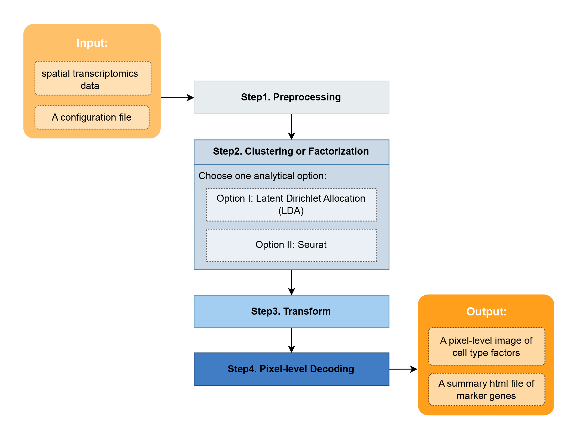

# Spatial Transcriptomics Analysis

This section provides an example of how to identify spatial factors at pixel-level resolution in spatial transcriptomics data, which is generated by [NovaScope](https://github.com/seqscope/NovaScope/tree/main). NEDA currently offers two analytical strategies:

1) **Latent Dirichlet Allocation (LDA) + FICTURE**:
This strategy utilizes Latent Dirichlet Allocation (LDA) to identify spatial factors. Subsequently, [FICTURE](https://github.com/seqscope/ficture) is employed to map these identified factors onto a histological space with pixel-level resolution.

2) **Seurat + FICTURE**: In this strategy, multi-dimensional clustering via [Seurat](https://satijalab.org/seurat/) is applied to explore cell type clusters. These clusters are then projected into a histological space, achieving pixel-level resolution through the use of [FICTURE](https://github.com/seqscope/ficture).

**Figure 1: A Brief Overview of the Inputs, Outputs, and Process Steps for Spatial Transcriptomics Analysis.** 

## Step-by-Step Procedure

Before beginning the analysis, ensure that NEDA and its dependencies are [installed](../../installation/installation.md) in your computing environment. Follow these steps as outlined:

1. Prepare your [input dataset](./prepare_data.md) and its corresponding [input configuration file](./job_config.md).

2. [Set up your computing environment](./step1-preprocess.md), preprocess the spatial transcriptomic data, and create minibatches for subsequent analysis.

3. Choose the analytical strategy that best suits your project, either [LDA](./step2a-LDA.md) or [Seurat](./step2b-seurat.md), to yield clusters or factors from your dataset.

4. [Transform](./step3-transform.md) and [decode](./step4-decode.md) these clusters or factors on your input data at pixel-level resolution.

Detailed instructions for each step are available on the corresponding pages, including:

* The **purpose** of each step;
* The **execution command**;
* Necessary **input and output files**;
* Definitions of **auxiliary parameters**, as outlined in the scripts for each step.
