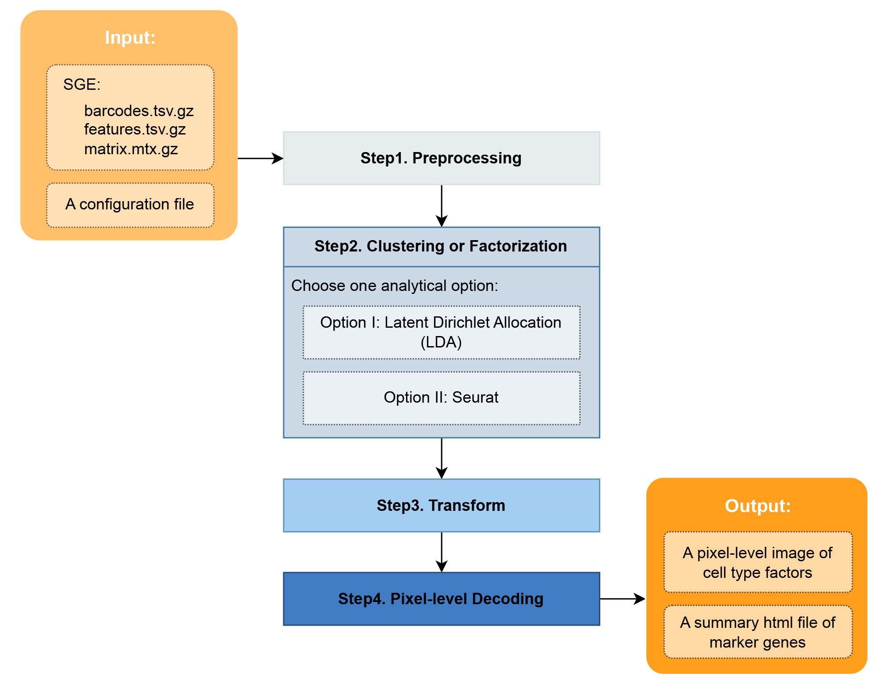

# Guide for NovaScope Exemplary Downstream Analysis (NEDA)

This is an exemplary downstream analysis for Spatial Transcriptomics data from [NovaScope](https://github.com/seqscope/NovaScope/tree/main). 

Currently, this NovaScope Exemplary Downstream Analysis (NEDA) offers two analytical strategies:

1) **Latent Dirichlet allocation (LDA) + FICTURE**:  
    This strategy utilizes LDA for the identification of spatial factors. Subsequently, [FICTURE](https://github.com/seqscope/ficture) is employed to map these identified factors onto a histological space with pixel-level resolution.

2) **Seurat + FICTURE**: 
    In this strategy, multi-dimensional clustering via Seurat is applied to explore cell type clusters. These clusters are then projected into a histological space, achieving pixel-level resolution through the use of FICTURE.

## Preparation

First, please refer to [`prestep1-setup.md`](./preparation/prestep1-setup.md) for guidance on installing the required software and packages, and downloading gene reference data. 

Next, proceed with [`prestep2-input.md`](./preparation/prestep2-input.md) to prepare the input data and configuration file for NEDA analysis. 

## A Brief Overview

**Figure 1: A Brief overview of the inputs, outputs, and process steps in NEDA.**
The strategies "LDA + FICTURE" and "Seurat + FICTURE" share the scripts of step1.preprocessing step3.transform, and step4.pixel-level decoding. Their differences lie in two main areas: 1) the configuration file used for input; and 2) the procedures and output files in the second step. Details for each step are provided in the step-by-step instructions. SGE: spatial digital gene expression. 

## Step-by-Step Instructions 

First choose the analytical strategy that fits your case. We include examples that detail the step-by-step process for both the ["LDA + FICTURE"](./LDA/step1-preprocess.md) and ["Seurat + FICTURE"](./Seurat/step1-preprocess.md) analytical strategies, each presented separately. We recommend executing these steps sequentially. 

For each step, the instructions include both the **purpose** and the **execution command**. To ensure clarity, the instructions specifically detail the required **input files and the output files** that will be generated.

The example input configuration file sets the essential parameters, while certain steps might need **auxiliary parameters**. In such cases, NEDA employs FICTURE's recommended defaults for these extra settings, wherever applicable. Should you wish to customize these auxiliary parameters beyond the defaults, please proceed with caution as it involves risk. For detailed information on modifying auxiliary parameters, kindly refer to the `AUXILIARY PARAMS` section found in the script for each respective step. For instance, the script [step2.1-create-hexagons.sh](https://github.com/seqscope/NovaScope-exemplary-downstream-analysis/blob/main/steps/step2a.1-create-hexagons.sh) for generating hexagonal spatial digital gene expression (SGE) matrix for LDA needs extra auxiliary parameters, which are specified between lines 26 and 30. For each auxiliary parameter, please consult the original publication of [FICTURE](https://www.biorxiv.org/content/10.1101/2023.11.04.565621v2).

## Notes
* The "Seurat + FICTURE" strategy involves two points at which manual assessment is required.
* This tutorial assumes the X-axis as the major axis due to its greater length in our example data. Sorting and tabix steps are thus aligned with the X-axis in this downstream analysis. The major axis can be defined as Y-axis via the input configuration file.